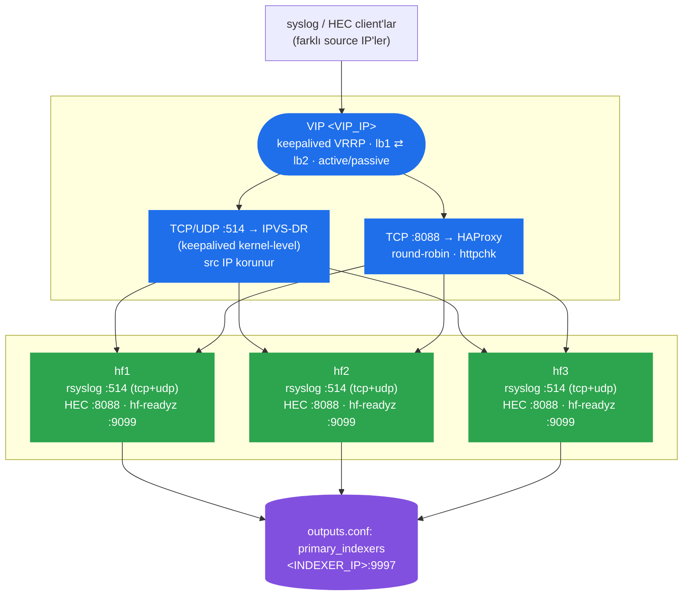
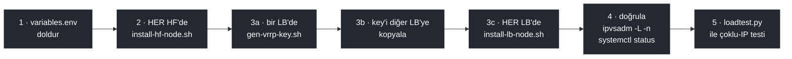

# Splunk Syslog + HEC HA Mimarisi — Deploy Template

2 LB node (keepalived + HAProxy, active/passive) + 3 Splunk Heavy Forwarder (HF)
node'u için hazır, test edilmiş config template'i. Üretimde doğrulanmıştır:
TCP 514 ve UDP 514 syslog **IPVS Direct Routing** (keepalived) ile, HEC (8088)
**HAProxy** ile load-balance edilir; syslog'da gerçek client source IP, HF'lerde
`$fromhost-ip` üzerinden korunur (HAProxy'den geçmez).



## Klasör yapısı

```
lb-nodes/
  common/                      # Her iki LB node'da BİREBİR aynı dosyalar
    haproxy/haproxy.cfg
    keepalived/check_haproxy.sh
    keepalived/check_hf_ready.sh
  lb1/keepalived/keepalived.conf   # lb1'e özel (priority, unicast_src_ip)
  lb2/keepalived/keepalived.conf   # lb2'ye özel
hf-nodes/                      # Her 3 HF node'da BİREBİR aynı dosyalar
  rsyslog.d/49-hf-syslog-listener.conf
  sysctl.d/60-lvs-dr-realserver.conf
  systemd/lvs-realserver-vip.service
  systemd/hf-readyz.service
  hf-readyz/readyz.py
  splunk/inputs.conf.snippet
scripts/
  install-lb-node.sh           # LB node'a dosyaları kurar + servisleri başlatır
  install-hf-node.sh           # HF node'a dosyaları kurar + servisleri başlatır
  gen-vrrp-key.sh              # VRRP auth_hmac key dosyasını üretir
loadtest/
  loadtest.py                  # Çoklu source-IP TCP+UDP eşzamanlı yük testi
variables.env                  # Tüm <PLACEHOLDER> değerlerinin tanımlandığı dosya
```

## Önkoşullar (hedef 5 host için)

- **lb1, lb2**: Ubuntu 24.04+ (veya benzeri), aynı L2 subnet'te, 3. network üzerinden
  birbirine unicast VRRP ulaşabiliyor olmalı.
- **hf1, hf2, hf3**: Splunk kurulu (Heavy Forwarder rolü), aynı L2 subnet'te
  (IPVS-DR aynı broadcast domain gerektirir — router arkasında olamaz).
- Her 5 host'ta: `rsyslog`, `haproxy` (sadece lb'lerde), `keepalived` (sadece
  lb'lerde), `ipvsadm`+`ip_vs` kernel modülü (lb'lerde), Python 3 (hf'lerde).
- Splunk'ta bir HEC token (tüm HF'lerde **aynı token değeri**, enableSSL=0).

## Kurulum sırası



1. `variables.env` dosyasını doldur (VIP, lb1/lb2 IP'leri, hf1/2/3 IP'leri,
   indexer IP'si, HEC token, router_id'ler).
2. **Önce HF'ler**: her hf node'da `scripts/install-hf-node.sh` çalıştır.
   - VIP'i `lo:vip200`'e ekler (ARP suppression sysctl'leriyle birlikte)
   - rsyslog dinleyici config'ini kurar
   - `hf-readyz` (port 9099) health servisini kurar
   - Splunk `inputs.conf`'una HEC + monitor stanza'larını ekler (elle onay ister)
3. **Sonra LB'ler**: her lb node'da `scripts/gen-vrrp-key.sh` ile VRRP auth
   key'i üret (iki node'da da **aynı key dosyası** olmalı — birini üretip
   diğerine kopyala), sonra `scripts/install-lb-node.sh` çalıştır.
4. `ipvsadm -L -n` (her iki LB'de) ve `systemctl status keepalived haproxy`
   ile doğrula.
5. `loadtest/loadtest.py` ile `VIP:514` TCP/UDP'ye çoklu source-IP testi at,
   HF'lerde `/opt/data/<source-ip>/` altında doğru dosyaların oluştuğunu
   doğrula.

## Önemli tasarım notları

- **Syslog HAProxy'den GEÇMEZ.** Sadece keepalived'in IPVS-DR real_server'ları
  üzerinden gider — bu, client source IP'nin HF'de korunmasının tek yolu.
  HAProxy syslog'u da üstlenirse (log-forward/mode log ile mümkün olsa da)
  source IP kaybolur, rsyslog'un per-IP klasör mantığı bozulur.
- **DR modu aynı L2 subnet gerektirir.** Router arkasındaki HF'lerle
  çalışmaz — o durumda NAT moduna geçip HF'lerin default gateway'ini
  LB'ye yönlendirmek gerekir (bkz. keepalived.conf içindeki yorum).
- **keepalived `nopreempt`** kullanılıyor: failover sonrası eski master
  geri gelse bile VIP'i otomatik geri almaz (kasıtlı — flapping'i önler).
  Elle geri almak için `systemctl restart keepalived` (düşük öncelikli
  node'u) yeterli.
- **chk_haproxy, syslog/IPVS sağlığını TAKİP ETMEZ** — 3 HF'nin de syslog
  tarafı düşse bile VIP/VRRP failover tetiklenmez (bu bir alerting durumu,
  failover sebebi değil). Sadece HAProxy/8088 sağlığı VRRP'yi etkiler.
- **HEC token değeri** tüm HF'lerde aynı olmalı (stanza adı farklı olabilir,
  önemli olan `token = ...` değeri).
