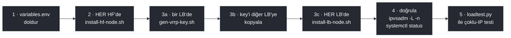

# Splunk Syslog + HEC HA Mimarisi — Deploy Template

2 LB node (keepalived + HAProxy, active/passive) + N Splunk Heavy Forwarder (HF; örnekte 3)
node'u için hazır, test edilmiş config template'i. Üretimde doğrulanmıştır:
TCP 514 ve UDP 514 syslog **IPVS Direct Routing** (keepalived) ile, HEC (8088)
**HAProxy** ile load-balance edilir; syslog'da gerçek client source IP, HF'lerde
`$fromhost-ip` üzerinden korunur (HAProxy'den geçmez).


## Klasör yapısı

```
lb-nodes/
  common/                      # Her iki LB node'da BİREBİR aynı dosyalar
    haproxy/haproxy.cfg
    keepalived/check_haproxy.sh
    keepalived/check_hf_ready.sh
    keepalived/notify.sh          # VRRP/HF anlık olay bildirimi (syslog + HEC + ops. Slack)
    status/lb-status.py           # periyodik durum kontrolü/raporu (+ systemd timer'ları)
  lb1/keepalived/keepalived.conf   # lb1'e özel (priority, unicast_src_ip)
  lb2/keepalived/keepalived.conf   # lb2'ye özel
  splunk/indexes.conf.snippet      # lb_status index tanımı (indexer + HF'ler)
hf-nodes/                      # Her HF node'da BİREBİR aynı dosyalar
  rsyslog.d/49-hf-syslog-listener.conf
  sysctl.d/60-lvs-dr-realserver.conf
  systemd/lvs-realserver-vip.service
  systemd/hf-readyz.service
  systemd/hf-syslog-cleanup.{service,timer}  # ceyreklik retention temizligi
  cleanup/hf-syslog-cleanup.sh
  hf-readyz/readyz.py
  splunk/inputs.conf.snippet
scripts/
  install-lb-node.sh           # LB node'a dosyaları kurar + servisleri başlatır
  install-hf-node.sh           # HF node'a dosyaları kurar + servisleri başlatır
  lib.sh                       # ortak render (yer tutucu kontrolü) + HF_NODES
  gen-vrrp-key.sh              # VRRP auth_hmac key dosyasını üretir
  prepare-offline-bundle.sh    # Air-gapped LB kurulumu için paket bundle'ı hazırlar
loadtest/
  loadtest.py                  # Çoklu source-IP TCP+UDP eşzamanlı yük testi
  loadtest_high_volume.py      # Yüksek hacimli (1M+, >200k eps) sürüm
variables.env                  # Tüm <PLACEHOLDER> değerlerinin tanımlandığı dosya
```

## Önkoşullar (2 LB + N HF)

- **lb1, lb2**: Ubuntu 24.04+ (veya benzeri), aynı L2 subnet'te, 3. network üzerinden
  birbirine unicast VRRP ulaşabiliyor olmalı.
- **HF'ler (`HF_NODES`, 2, 3 veya daha fazla)**: Splunk kurulu (Heavy Forwarder rolü), aynı L2 subnet'te
  (IPVS-DR aynı broadcast domain gerektirir — router arkasında olamaz).
  Ubuntu/Debian veya RHEL 7/8/9 ailesi; rsyslog ≥ 8.24 (RHEL 7'nin sürümü).
  `install-hf-node.sh` Ubuntu'da AppArmor'a, SELinux açıksa `DATA_DIR`'e
  `var_log_t` etiketi (`semanage fcontext` + `restorecon`) verir. firewalld
  açıksa 514/tcp+udp, HEC ve readyz portları kapalıysa uyarır (otomatik açmaz).
- Tüm host'larda: `rsyslog`, `haproxy` (sadece lb'lerde), `keepalived` (sadece
  lb'lerde), `ipvsadm`+`ip_vs` kernel modülü (lb'lerde), Python 3 (hf'lerde).
- Splunk'ta bir HEC token (tüm HF'lerde **aynı token değeri**, enableSSL=0).

### LB'ler internete çıkamıyorsa (air-gapped)

`install-lb-node.sh` normalde iki şey için internet ister: apt paketleri
(haproxy/ipvsadm/ipset/build-essential/...) ve keepalived 2.4.3'ün kaynak
tarball'ı (keepalived.org). İnternetsiz bir LB için:

```bash
# 1) İNTERNETİ OLAN, hedefle AYNI Ubuntu sürümündeki bir makinede:
./scripts/prepare-offline-bundle.sh ./offline-bundle

# 2) ./offline-bundle klasörünü scp/usb/vb. ile air-gapped LB'ye taşı

# 3) air-gapped LB'de -- apt-get update/curl HİÇ çalıştırılmaz:
./scripts/install-lb-node.sh lb1 ./offline-bundle
```

`prepare-offline-bundle.sh` haproxy'yi de aynı vbernat PPA'dan (3.4 serisi)
indirir, böylece offline kurulum online kurulumla aynı haproxy sürümünü
alır.

## Kurulum sırası



1. `variables.env` dosyasını doldur (VIP, lb1/lb2 IP'leri, `HF_NODES` (ad:ip listesi),
   indexer IP'si, HEC token, router_id'ler).
2. **Önce HF'ler**: her hf node'da `scripts/install-hf-node.sh` çalıştır.
   - VIP'i `lo:vip200`'e ekler (ARP suppression sysctl'leriyle birlikte)
   - rsyslog dinleyici config'ini kurar
   - `hf-readyz` (port 9099) health servisini kurar
   - `hf-syslog-cleanup.timer`'ı kurar (`SYSLOG_RETENTION_HOURS`, varsayılan 5 saat)
   - Splunk `inputs.conf`'una HEC + monitor stanza'larını ekler (elle onay ister)
3. **Sonra LB'ler**: her lb node'da `scripts/gen-vrrp-key.sh` ile VRRP auth
   key'i üret (iki node'da da **aynı key dosyası** olmalı — birini üretip
   diğerine kopyala), sonra `scripts/install-lb-node.sh` çalıştır.
4. `ipvsadm -L -n` (her iki LB'de) ve `systemctl status keepalived haproxy`
   ile doğrula.
5. `loadtest/loadtest.py` ile `VIP:514` TCP/UDP'ye çoklu source-IP testi at,
   HF'lerde `/data/log/splunk/syslog/<source-ip>/` altında doğru dosyaların oluştuğunu
   doğrula.

### Yüksek hacimli yük testi (1M+, 30k+ eps)

```bash
# Önce gönderici makinede birkaç IP alias ekle (SRC_IPS listesindekiler):
ip addr add 10.100.100.221/24 dev eth0
ip addr add 10.100.100.222/24 dev eth0
ip addr add 10.100.100.223/24 dev eth0
ip addr add 10.100.100.224/24 dev eth0

python3 loadtest/loadtest_high_volume.py            # 1M mesaj, varsayilan
python3 loadtest/loadtest_high_volume.py myrun 50000 1   # ozel runid/hacim/tcp-conn
```

Bu ortamda ölçülen sonuç: ~210-230k eps gönderim, **%100 TCP + ~%99.7-99.9 UDP**
teslimat (3 HF toplamında doğrulandı).

**Kendi yük test script'ini yazarsan dikkat et:** gönderici thread'lerini
**flat** oluştur -- hepsini önce bir listeye ekle, sonra hepsini `start()`
+ `join()` et. Bu script'i yazarken bulundu: *nested* thread spawning
(bir "parent" thread kendi içinde yeni thread'ler yaratıp onları join
ediyor -- örn. "her source IP için bir thread, o thread de kendi içinde
N TCP-connection thread'i yaratıp bekliyor") Python'un GIL rekabeti
yüzünden TCP `connect()`/`sendall()` zamanlamasını bozuyor: veri
"gönderildi" sayılıyor (`sendall()` hata vermeden dönüyor) ama bir kısmı
gerçekte iletilmiyor. Ölçülen etki: nested yapıda TCP teslimatı %28-33'e
düşüyor, flat yapıyla %100'e çıkıyor (UDP ikisinde de ~%99.7-99.9 ile
sabit -- UDP'de zaten garanti yok). Mimarinin kendisiyle **hiçbir
ilgisi yok** -- IPVS-DR, HAProxy, rsyslog hepsi suçsuz; sorun sadece
test script'inin threading deseninde.

## Önemli tasarım notları

- **Syslog HAProxy'den GEÇMEZ.** Sadece keepalived'in IPVS-DR real_server'ları
  üzerinden gider — bu, client source IP'nin HF'de korunmasının tek yolu.
  HAProxy syslog'u da üstlenirse (log-forward/mode log ile mümkün olsa da)
  source IP kaybolur, rsyslog'un per-IP klasör mantığı bozulur.
- **DR modu aynı L2 subnet gerektirir.** Router arkasındaki HF'lerle
  çalışmaz — o durumda NAT moduna geçip HF'lerin default gateway'ini
  LB'ye yönlendirmek gerekir (bkz. keepalived.conf içindeki yorum).
- **keepalived `nopreempt`** kullanılıyor: failover sonrası eski master
  geri gelse bile VIP'i otomatik geri almaz (kasıtlı — flapping'i önler).
  Elle geri almak için `systemctl restart keepalived` (düşük öncelikli
  node'u) yeterli.
- **Splunk'ta `host` = syslog kaynak IP'si.** Monitor stanza'sı
  `host_segment` kullanır: `<DATA_DIR>/<kaynak-ip>/...` yolundaki IP parçası
  `host` alanına yazılır (`install-hf-node.sh` sırayı `DATA_DIR`'dan hesaplar,
  `/data/log/splunk/syslog` için 5). Bu olmadan `host` HF'nin adı olur ve
  kaynak IP sadece `source` yolunda kalır.
- **Syslog retention.** rsyslog her kaynak IP için çeyrek saatlik dosya açar
  (`<host>-YYYY-MM-DD-HH-QQ.log`, `QQ` = `00`..`03` → :00/:15/:30/:45 çeyreği);
  temizlenmezse disk dolar, `readyz` `disk_ok` düşer ve HF havuzdan çıkar.
  `hf-syslog-cleanup.timer` her çeyreğin 2. dakikasında çalışır, son yazımı
  `SYSLOG_RETENTION_HOURS` (varsayılan 5) saatten eski `*.log` dosyalarını ve
  uzun süredir boş kaynak-IP klasörlerini siler — her kaynak için son ~5 saatin
  (~20 çeyrek dosyası) kalır. **Dikkat:** Splunk bu süre içinde dosyayı
  okuyamazsa (ör. indexer 5 saatten uzun erişilemez ve HF'nin output kuyruğu
  dolarsa) okunmamış dosyalar silinir. 5 saat varsayılandır; farklı bir süre
  isteyen `variables.env`'de `SYSLOG_RETENTION_HOURS`'u değiştirip
  `install-hf-node.sh`'ı yeniden çalıştırır. Temizliği zaten kendi
  cron/logrotate'i yapan HF'lerde `SYSLOG_RETENTION_HOURS=0` ile timer kapatılır.
- **rsyslog ayarları (`variables.env`).** `SYSLOG_QUEUE_SIZE/WORKERS/BATCH`
  `splunk` ruleset kuyruğunu, `SYSLOG_UDP_RMEM_BYTES` (varsayılan 32 MB) HF'nin
  UDP alma buffer'ını (`net.core.rmem_default`/`rmem_max`) belirler — yüksek
  EPS'teki UDP kaybı kuyruktan önce, socket buffer'da olur. `SYSLOG_QUEUE_DISK=yes`
  disk destekli kuyruğu açar (varsayılan kapalı; sınırları `variables.env`'de).
  Config legacy `$` syntax'ındadır; `$MainMsgQueue*` ayarları rsyslog'un sistem
  ana kuyruğuna da uygulanır.
- **HEC ve indexer acknowledgment (`useACK`).** Ack sorgusu, o channel'ın
  event'lerini alan HF'ye gitmek zorunda; düz roundrobin bunu bozar.
  `HEC_SSL=0` iken HAProxy `mode http` çalışır: her istek ayrı dengelenir
  (keep-alive istemciler tek HF'ye yapışmaz) ve `X-Splunk-Request-Channel`
  (veya `?channel=`) üzerinden consistent hash ile aynı HF'ye gider; channel'sız
  istekler roundrobin. `HEC_SSL=1` iken TLS passthrough olduğundan header
  görülemez, `HEC_TLS_BALANCE` (varsayılan `source`, istemci IP'sine göre)
  kullanılır; useACK yoksa `roundrobin` yapılabilir.
- **Syslog TCP ve UDP havuzları aynı sağlık sinyalini kullanır.** İkisi de
  `check_hf_ready.sh <ip> tcp|udp` → `/readyz/syslog` (rsyslog, listener'lar,
  disk) ile kontrol edilir, havuz başına ayrı rise sayacı tutulur; TCP ayrıca
  `TCP_CHECK`'i korur. Diski dolan bir HF iki havuzdan birden çıkar.
- **Durum izleme ve bildirim (Splunk + opsiyonel Slack).** İki kaynak:
  - *keepalived `notify.sh`* (anlık): VRRP geçişleri (MASTER/BACKUP/FAULT), bir
    HF'nin syslog TCP/UDP havuzuna girip çıkması, havuzda **hiç HF kalmaması**.
  - *`lb-status`* (systemd timer): `check` her `STATUS_CHECK_INTERVAL_SEC`
    (60 sn) durumu toplar — HAProxy stats (HEC), IPVS (`ipvsadm --rate`), her
    HF'nin readyz'i (disk, yük, bellek), yedek LB erişimi — ve **yeni çıkan /
    düzelen** sorunu hemen bildirir (HEC'te HF düşmesi, HEC'te hiç HF kalmaması,
    readyz'e ulaşılamaması, HF diski `STATUS_DISK_WARN_PCT` altında, LB servis/
    disk). `report` her `STATUS_REPORT_INTERVAL_MIN` (60 dk): her şey normalse
    tek satır, sorun varsa tablo.

  Hedefler: **Splunk HEC** her zaman (`STATUS_INDEX`, varsayılan `lb_status`,
  kısa retention): `sourcetype=lb:status` (her check'te tam durum JSON'u) ve
  `sourcetype=lb:event:hec` (anlık olaylar; Splunk alert'leri buna kurulur).
  Gönderim yerel HAProxy üzerinden, HAProxy çöktüyse doğrudan HF'lere. Index'in
  indexer'da ve HF'lerde tanımlı olması gerekir (`install-lb-node.sh` sonunda
  `indexes.conf` parçasını basar). **Slack** sadece `SLACK_ENABLED=yes` ise
  (varsayılan kapalı). HF olaylarını ve raporu sadece VIP'i tutan LB gönderir
  (çift mesaj olmaz); her LB kendi servis/disk sorununu bildirir.
  `ALERT_SITE_NAME` aynı kanala/index'e yazan kurulumları ayırır; Slack için
  proxy `SLACK_PROXY`. HEC token'ı ve webhook URL'i sırdır: LB'de
  `/etc/keepalived/keys/` altında 0600 tutulur; `variables.env`'i doldurulmuş
  haliyle commit etme. Deneme: `lb-status check --dry-run`,
  `lb-status report --dry-run` (göndermez, ekrana basar).
- **chk_haproxy, syslog/IPVS sağlığını TAKİP ETMEZ** — tüm HF'lerin syslog
  tarafı düşse bile VIP/VRRP failover tetiklenmez (bu bir alerting durumu,
  failover sebebi değil). Sadece HAProxy/8088 sağlığı VRRP'yi etkiler.
- **HEC token değeri** tüm HF'lerde aynı olmalı (stanza adı farklı olabilir,
  önemli olan `token = ...` değeri).
- **`net.ipv4.vs.expire_nodest_conn = 1`** her iki LB'de kurulu olmalı
  (`install-lb-node.sh` bunu otomatik yapar). Olmadan: bir HF düştüğünde,
  o HF'ye zaten bağlanmış mevcut UDP akışları (TCP değil — TCP bağlantı
  koptuğunda client zaten yeniden bağlanmak zorunda kalır) connection-template
  timeout'una kadar (dakikalar) o ölü HF'ye gitmeye devam eder, health-check
  real_server'ı havuzdan çıkarmış olsa bile. Bu sysctl, kernel'e "hedefi
  silinen akışları hemen süresiz bırak, yeni paket geldiğinde yeniden
  zamanla" der. 2026-10-02 failover testinde ölçülen fark: olmadan etkilenen
  akışların teslimatı kalıcı olarak %8'e düşüyordu, bununla health-check
  tespit penceresinden (~3-9s) sonra otomatik olarak sağlıklı bir HF'ye
  geçiyor.

- **`USE_VMAC` (variables.env, varsayılan `no`).** keepalived VRRP sanal MAC'i
  (`use_vmac vrrp200`) kapalıyken VIP, `VRRP_INTERFACE` üzerinde VM'in gerçek
  MAC'iyle yayınlanır; failover'da gratuitous ARP kullanılır. **VMware ESXi'de
  port group "Forged Transmits" / "MAC Address Changes" = Reject ise sanal MAC
  (`00:00:5e:00:01:xx`) çıkışta düşürülür**: keepalived ARP cevabını üretir
  ama istemci hiç almaz, VIP dışarıdan ping/ARP almaz (tcpdump'ta reply
  görünür ama karşı taraf alamaz). Bu durumda `USE_VMAC=no` bırak. Altyapı
  sanal MAC'e izin veriyorsa (Proxmox, ESXi'de Accept) `yes` yapılabilir.
  `install-lb-node.sh` değeri uygular ve eski `vrrp200` arayüzünü temizler.

- **Deployment Server yönlendirme (opsiyonel, `DS_IP`).** `variables.env`'de
  `DS_IP` doldurulursa HAProxy `<VIP>:DS_LISTEN_PORT` (varsayılan 8089)
  bağlantılarını `DS_IP:DS_PORT`'a (`mode tcp`, TLS geçirilir) iletir; böylece
  UF/HF'lerin `deploymentclient.conf` `targetUri`'si VIP olabilir. `DS_IP` boş
  bırakılırsa (varsayılan) haproxy.cfg'ye hiçbir şey eklenmez. DS istemcileri LB
  IP'si olarak görür (proxy); kimlik GUID/hostname ile tutulur. Tek hedef
  olduğundan HA sağlamaz, sadece sabit giriş adresi verir.
